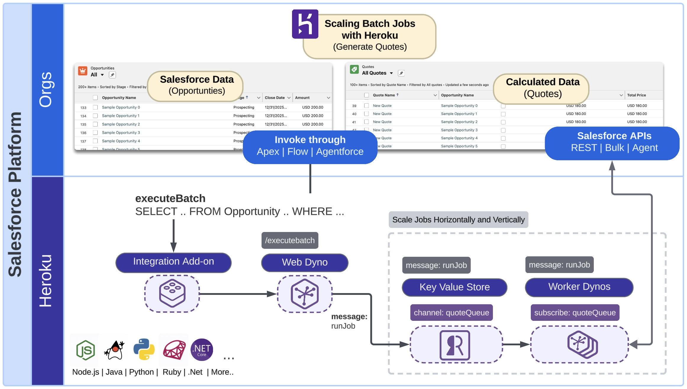
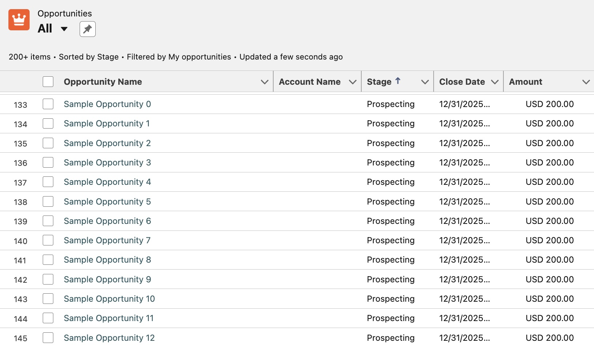
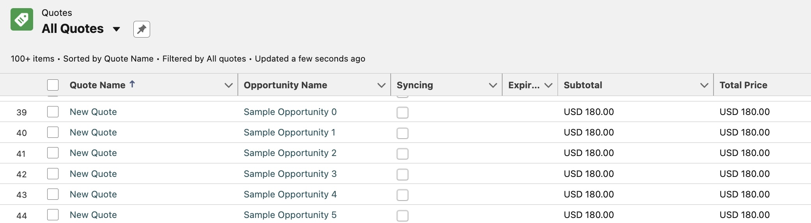
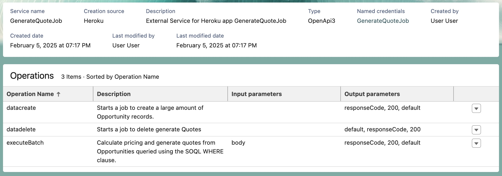

Heroku Integration - Scaling Batch Jobs with Heroku - Java
==========================================================

> [!IMPORTANT]
> For use with the Heroku Integration and Heroku Eventing pilots only

This sample seamlessly delegates the processing of large amounts of data with significant compute requirements to Heroku Worker processes. It also demonstrates the use of the Unit of Work aspect of the SDK (JavaScript only for the pilot) for easier utilization of the Salesforce Composite APIs.

# Architecture Overview

The scenario used in this sample illustrates a basis for processing large volumes of Salesforce data using elastically scalable Heroku worker processes that execute complex compute calculations. In this case **Opportunity** data is read and calculated pricing data is stored in an associated **Quote**. Calculating quote information from opportunities can become quite intensive, especially when large multinational businesses have complex rules that impact pricing related to region, products, and discount thresholds. It's also possible that such code already exists, and there is a desire to reuse it within a Salesforce context. 



This sample includes two process types `web` and `worker`, both can be scaled vertically and horizontally to speed up processing. The `web` process will receive API calls from Salesforce and `worker` will execute the jobs asynchronously. A [Heroku Key Value Store](https://elements.heroku.com/addons/heroku-redis) is used to create means to communicate between the two processes.

> [!NOTE]
> This sample could be considered an alternative to using Batch Apex if your data volumes and/or compute complexity requires it. In addition Heroku worker processes scale elastically and can thus avoid queue wait times impacting processing time that can occur with Batch Apex. For further information see **Technical Information** below.

# Requirements
- Heroku login
- Heroku Integration Pilot enabled
- Heroku CLI installed
- Heroku Integration Pilot CLI plugin is installed
- Salesforce CLI installed
- Login information for one or more Scratch, Development or Sandbox orgs
- Watch the [Introduction to the Heroku Integration Pilot for Developers](https://www.youtube.com/watch?v=T5kOGNuTCLE) video 

# Local Development and Testing

As with other samples (see below) this section focuses on how to develop and test locally before deploying to Heroku and testing from within a Salesforce org. Using the `heroku local` command and a local version of the standard `Procfile` we can easily launch locally both these processes from one command. Run the following commands to run the sample locally against a remotely provisioned [Heroku Key Value Store](https://devcenter.heroku.com/articles/heroku-redis).

> [!IMPORTANT]
> If have deployed the application, as described below and want to return to local development, you may want to destroy it to avoid race conditions since both will share the same job queue, use `heroku destroy`. In real situation you would have a different queue store for developer vs production.

Start with the following commands to create an empty application and provision within Heroku a key value store this sample uses to manage the job queue:

```
heroku create
heroku addons:create heroku-redis:mini --wait
heroku config --shell > .env
mvn clean package
heroku local -f Procfile.local web=1,worker=1
```

### Generating test data

Open a new terminal window and enter the following command to start a job that generates sample data:

```
./bin/invoke.sh my-org 'http://localhost:8080/api/data/create' '{}'
```

> The default is to create 100 Opportunities, however if you want to experiment with more use `http://localhost:8080/api/data/create?numberOfOpportunities=5000`

This will respond with a job Id, as shown in the example below:

```
Response from server:
{"jobId":"b7bfb6bd-8db8-4e4f-b0ad-c98966e91dde"}
```

Review the log output from the `heroku local` process and you will see output similar to the following:

```
web.1    | PricingEngineService : Received Opportunity data creation request
web.1    | PricingEngineService : Job enqueued with ID: b7bfb6bd-8db8-4e4f-b0ad-c98966e91dde for message: create to channel: dataQueue
worker.1 | SampleDataWorkerService : Worker received job with ID: b7bfb6bd-8db8-4e4f-b0ad-c98966e91dde for data operation: create
worker.1 | SampleDataWorkerService : Created Bulk Job for Opportunity: Job ID = 750am00000LrWbxAAF
worker.1 | SampleDataWorkerService : Submitted batch for Job ID 750am00000LrWbxAAF: Batch ID = 751am00000Lh7LYAAZ
worker.1 | SampleDataWorkerService : Batch 751am00000Lh7LYAAZ - State: InProgress
worker.1 | SampleDataWorkerService : Batch 751am00000Lh7LYAAZ - State: Completed
worker.1 | SampleDataWorkerService : Batch processing complete.
worker.1 | SampleDataWorkerService : Closed Bulk Job: 750am00000LrWbxAAF
worker.1 | SampleDataWorkerService : Opportunities created successfully.
worker.1 | SampleDataWorkerService : Created Bulk Job for OpportunityLineItem: Job ID = 750am00000LrKNxAAN
worker.1 | SampleDataWorkerService : Submitted batch for Job ID 750am00000LrKNxAAN: Batch ID = 751am00000LhIyUAAV
worker.1 | SampleDataWorkerService : Batch 751am00000LhIyUAAV - State: InProgress
worker.1 | SampleDataWorkerService : Batch 751am00000LhIyUAAV - State: Completed
worker.1 | SampleDataWorkerService : Batch processing complete.
worker.1 | SampleDataWorkerService : Closed Bulk Job: 750am00000LrKNxAAN
worker.1 | SampleDataWorkerService : Opportunity Products created successfully.
```

Finally navigate to the **Opportunities** tab in your Salesforce org and you should see something like the following



### Running the generate quotes job locally

Run the following command to execute a batch job to generate **Quote** records from the **Opportunity** records created above.

```
./bin/invoke.sh my-org http://localhost:8080/api/executebatch '{"soqlWhereClause": "Name LIKE '\''Sample Opportunity%'\''"}'
```

Observe the log output from `heroku local` and you will see output similar to the following:

```
web.1    | PricingEngineService : Received generate Quotes request for Opportunities matching: Name LIKE 'Sample Opportunity%'
web.1    | PricingEngineService : Job enqueued with ID: cfb56b17-b2f5-433a-b8df-ea27574a350b for message: Name LIKE 'Sample Opportunity%' to channel: quoteQueue
worker.1 | PricingEngineWorkerService : Worker received job with ID: cfb56b17-b2f5-433a-b8df-ea27574a350b for SOQL WHERE clause: Name LIKE 'Sample Opportunity%'
worker.1 | PricingEngineWorkerService : Worker executing batch for Job ID: cfb56b17-b2f5-433a-b8df-ea27574a350b with WHERE clause: Name LIKE 'Sample Opportunity%'
worker.1 | PricingEngineWorkerService : Processing 100 Opportunities
worker.1 | PricingEngineWorkerService : Performing bulk insert for 100 Quotes
worker.1 | PricingEngineWorkerService : Performing bulk insert for 200 QuoteLineItems
worker.1 | PricingEngineWorkerService : Job processing completed for Job ID: cfb56b17-b2f5-433a-b8df-ea27574a350b
```

Navigate to the **Quotes** tab in your org to review the generates records:



Next we will deploy the application and import it into a Salesforce org to allow jobs to be started from Apex, Flow or Agentforce.

# Deploying and Testing

> [!IMPORTANT]
> Check you are not still running the application locally. If you want to start over at any time use `heroku destroy` to delete your app.

Steps below leverage the `sf` CLI as well so please ensure you have authenticated your org already - if not you can use this command:

```
sf org login web --alias my-org
```

First, if you have not done so above, create the application and provision a key value store to manage the job queue.

```
heroku create
heroku addons:create heroku-redis:mini --wait
```

Next deploy the application and scale both the `web` and `worker` processes to run on a single dyno each.

```
git push heroku main
heroku ps:scale web=1,worker=1
```

Next config the Heroku Integration add-on and import the application into your Salesforce org as follows:

```
heroku addons:create heroku-integration
heroku buildpacks:add https://github.com/heroku/heroku-buildpack-heroku-integration-service-mesh
heroku salesforce:connect my-org --store-as-run-as-user
heroku salesforce:import api-docs.yaml --org-name my-org --client-name GenerateQuoteJob
```

Trigger an application rebuild to install the Heroku Integration buildpack

```
git commit --allow-empty -m "empty commit"
git push heroku main
```

Once imported grant permissions to users to invoke your code using the following `sf` command:

```
sf org assign permset --name GenerateQuoteJob -o my-org
```

Once imported you can see the `executeBatch` operation that takes a [SOQL WHERE clause](https://developer.salesforce.com/docs/atlas.en-us.soql_sosl.meta/soql_sosl/sforce_api_calls_soql_select_conditionexpression.htm) to select the **Opportunity** object records to process. Also note that the `datacreate` and `datadelete` operations are also exposed since they declared in the `api-docs.yaml` generated from the Java annotations within `PriceEngineService.java`. 



As noted in the [Extending Apex, Flow and Agentforce](https://github.com/heroku-examples/heroku-integration-pattern-org-action-java?tab=readme-ov-file#heroku-integration---extending-apex-flow-and-agentforce---java) sample you can now invoke these operations from Apex, Flow or Agentforce. Here is some basic Apex code to start the job to create the sample data (if you have not done so earlier):

```
echo \
"ExternalService.GenerateQuoteJob service = new ExternalService.GenerateQuoteJob();" \
"System.debug('Quote Id: ' + service.datacreate().Code200.jobId);" \
| sf apex run -o my-org
```

> [!NOTE]
> Run the `heroku logs --tail` command to monitor the logs to confirm the job completed.

Here is some basic Apex code you can run from the command line to start the generate Quotes job:

```
echo \
"ExternalService.GenerateQuoteJob service = new ExternalService.GenerateQuoteJob();" \
"ExternalService.GenerateQuoteJob.executeBatch_Request request = new ExternalService.GenerateQuoteJob.executeBatch_Request();" \
"ExternalService.GenerateQuoteJob_BatchExecutionRequest body = new ExternalService.GenerateQuoteJob_BatchExecutionRequest();" \
"body.soqlWhereClause = 'Name LIKE \\\\'Sample Opportunity%\\\\'';" \
"request.body = body;" \
"System.debug('Quote Id: ' + service.executeBatch(request).Code200.jobId);" \
| sf apex run -o my-org
```

> [!NOTE]
> Run the `heroku logs --tail` command to monitor the logs of the `web` and `worker` processes as you did when running locally.

Navigate to the **Quotes** tab in your org or one of the sample **Oppoortunties** to review the generates quotes. You can re-run this operation as many times as you like it will simply keep adding **Quotes** to the sample Opporunties created.

# Removing Sample Data

If you are running application locally, run the following command to execute a batch process to delete the sample **Opportunity** and **Quote** records.

```
./bin/invoke.sh my-org http://localhost:8080/api/data/delete '{}'
```

If you have deployed the application, run the following:

```
echo \
"ExternalService.GenerateQuoteJob service = new ExternalService.GenerateQuoteJob();" \
"System.debug('Quote Id: ' + service.datadelete().Code200.jobId);" \
| sf apex run -o my-org
```

Observe the log output from the `heroku local` or `heroku logs --tail` commands and you will see output similar to the following

```
web.1    | PricingEngineService : Received data deletion request
web.1    | PricingEngineService : Job enqueued with ID: fb4aeba1-a4d5-4f07-8477-1b26bd9b297f for message: delete to channel: dataQueue
worker.1 | SampleDataWorkerService : Worker received job with ID: fb4aeba1-a4d5-4f07-8477-1b26bd9b297f for data operation: delete
worker.1 | SampleDataWorkerService : Submitted batch for Job ID 750am00000Lr8MkAAJ: Batch ID = 751am00000LhOSqAAN
worker.1 | SampleDataWorkerService : Batch 751am00000LhOSqAAN - State: InProgress
worker.1 | SampleDataWorkerService : Batch 751am00000LhOSqAAN - State: Completed
worker.1 | SampleDataWorkerService : Batch processing complete.
worker.1 | SampleDataWorkerService : Closed Bulk Job: 750am00000Lr8MkAAJ
worker.1 | SampleDataWorkerService : Opportunities deleted successfully.
```

# Technical Information
- The [Heroku Key Value Store](https://elements.heroku.com/addons/heroku-redis) add-on is used to manage two channels that act as queues for sample data and quote generation jobs. The `mini` tier of this [add-on](https://devcenter.heroku.com/articles/heroku-redis) can be used for this sample. Spring Boot automatically configures Redis connections, see [here](https://devcenter.heroku.com/articles/connecting-heroku-redis#spring-boot) for more information.
- **Spring Boot** [profiles](https://docs.spring.io/spring-boot/reference/features/profiles.html) are used to allow the application to be configured to serve up endpoints for Salesforce to interact with or run worker processes to execute the jobs. Take a look at the `Procfile` to see how these are configured.
- `PricingEnginerWorkService` is using the [Salesforce WSC SDK](https://github.com/forcedotcom/wsc) to insert **Quote** and **QuoteLineItem** records in separate API calls and thus also separate transactions to Salesforce. This means if the lines fail to insert the Quote records will remain. To avoid this consider adding for production adding rollback logic or using the Salesforce Composite API to insert both sets of records together. In a future release a Heroku SDK will include support for the Unit of Work pattern that makes using the Composite API easier.
- `Procfile.local` is needed because the main `Procfile` references the Heroku Integration service mesh buildpack when starting the `web` process and this is not installed locally.
- `PricingEnginerWorkService` extracts org authentication details from the HTTP request and passes these onto the worker jobs. This design will likely change once this feature reaches GA.
- The [Heroku Connect](https://elements.heroku.com/addons/herokuconnect) add-on can be used as an alternative to reading and/or writing to an org via [Heroku Postgres](https://elements.heroku.com/addons/heroku-postgresql). This is an option to consider if your use case does not fit within the [Salesforce API limitations](https://developer.salesforce.com/docs/atlas.en-us.salesforce_app_limits_cheatsheet.meta/salesforce_app_limits_cheatsheet). In this case note that there will be some lag between data changes and updates in the Salesforce org caused by the nature of the synchronization pattern used by Heroku Connect. If this is acceptable this option will further increase performance. Of course a hybrid of using the Salesforce API for certain data access needs and Heroku Connect for others is also possible.
- This sample uses [Salesforce API Query More](https://developer.salesforce.com/docs/atlas.en-us.api_rest.meta/api_rest/resources_query_more_results.htm) pattern to retrieve more than 2000 records. See `PricingEngineWorkerService.queryAllRecords`.
- To create **Quote** records the standard REST API `create` operation is used. Since this has a limit of 200 records per call, this sample uses multi-threading to run batches of 200 inserts concurrently. See `PricingEngineWorkerService.createParallel`. The hard coded default is 20 concurrent requests. Per [Salesforce API limitations](https://developer.salesforce.com/docs/atlas.en-us.salesforce_app_limits_cheatsheet.meta/salesforce_app_limits_cheatsheet) only requests taking more than 20 seconds are subject to concurrency limits.
- To create sample data the Bulk API v1 (via Saleforce WSC) is used. In a future release support for Bulk API v2 will be provided via a dedicated SDK. For now Bulk API v1 has limitations that restrict maximum sample data volumes to 5000 Opportunities per batch. If you want to code against the newer API in your code you can use the session Id from the `PartnerConnection` with the [Bulk API v2](https://developer.salesforce.com/docs/atlas.en-us.api_asynch.meta/api_asynch/asynch_api_intro.htm).
- **An informal execution time comparison.** The pricing calculation logic is intentionally simple for the purposes of ensuring the technical aspects of using the Heroku Integration in this context are made clear. As the compute requirements fit within Apex limits, it was possible to create an Apex version of the job logic and this is included in `/src-org` folder. While not a formal benchmark, execution time over 5000 opportunities took ~24 seconds using the Heroku job approach vs ~150 seconds to run with Batch Apex, **an improvement of 144% in execution time**. During testing it was observed that this was largely due in this case to the longer dequeue times with Batch Apex vs being near instant with a Heroku worker.

Other Samples
-------------

| Sample | What it covers? |
| ------ | --------------- |
| [Salesforce API Access - Java](https://github.com/heroku-examples/heroku-integration-pattern-api-access-java) | This sample application showcases how to extend a Heroku web application by integrating it with Salesforce APIs, enabling seamless data exchange and automation across multiple connected Salesforce orgs. It also includes a demonstration of the Salesforce Bulk API, which is optimized for handling large data volumes efficiently. |
| [Extending Apex, Flow and Agentforce - Java](https://github.com/heroku-examples/heroku-integration-pattern-org-action-java) | This sample demonstrates importing a Heroku application into an org to enable Apex, Flow, and Agentforce to call out to Heroku. For Apex, both synchronous and asynchronous invocation are demonstrated, along with securely elevating Salesforce permissions for processing that requires additional object or field access. |
| [Scaling Batch Jobs with Heroku - Java](https://github.com/heroku-examples/heroku-integration-pattern-org-job-java) | This sample seamlessly delegates the processing of large amounts of data with significant compute requirements to Heroku Worker processes. It also demonstrates the use of the Unit of Work aspect of the SDK (JavaScript only for the pilot) for easier utilization of the Salesforce Composite APIs. |
| [Using Eventing to drive Automation and Communication](https://github.com/heroku-examples/heroku-integration-pattern-eventing-java) | This sample extends the batch job sample by adding the ability to use eventing to start the work and notify users once it completes using Custom Notifications. These notifications are sent to the user's desktop or mobile device running Salesforce Mobile. Flow is used in this sample to demonstrate how processing can be handed off to low-code tools such as Flow. |
